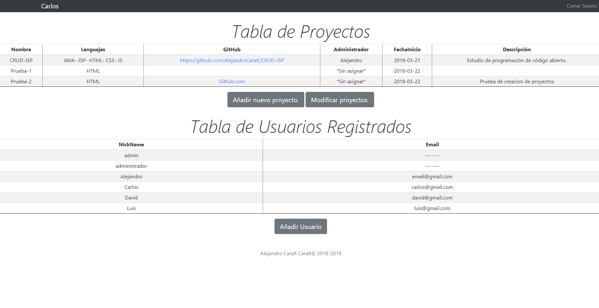

# CRUD-JSP
Trabajo de Alejandro Caralt Caralt.
# Temática
Estudio de programación de código abierto: Planificación de Proyectos OpenSource.

# Log-in 

## El sistema de sesión activa tiene fallos a la hora de cerrar la sesión.

# Registro de Usuario

## El registro toma en cuenta un nickname único en la base de datos.

# Página Principal

## Se muestran las dos tablas y opciones para añadir o modificarlas, exceptuando en la tabla de usuario que no se puede modificar.

# Registro de un Nuevo Proyeco

## El registro tiene en cuenta un código de proyecto con incremento automático, los campos de "Github", "Administrador" y "Descripción" son opcionales.

# Modificar Tabla de Proyectos

## Las modificaciones y las eliminaciones no se guardan, he encontrado varios fallos que no he podido solventar.

*De vez en cuando da un fallo en la misma línea del código la cual está vacía "System.out.print(usuario)" expected ";"
